# QDirStat Screenshots

Qt-based directory statistics: KDirStat without any KDE -- from the original KDirStat author.

(c) 2015-2021 Stefan Hundhammer <Stefan.Hundhammer@gmx.de>

Target Platforms: Linux, BSD, Unix-like systems

License: GPL V2

## QDirStat Main Window

### Different Main Window Layouts

Layout 1 (short): Only the bare minimum of tree columns plus the details panel for the selected item.

Layout 2 (classic): The classic QDirStat tree columns plus the details panel for the selected item.

Layout 3 (full): All tree columns including file owner, group and permissions in both "rwxrwxrwx" and octal,
but no details panel to make room for all the columns.

### Details Panel

File selected. Notice the "Package" field: For system files, QDirStat queries
the package manager (dpkg / rpm / pacman) which package the file belongs to.

Directory selected

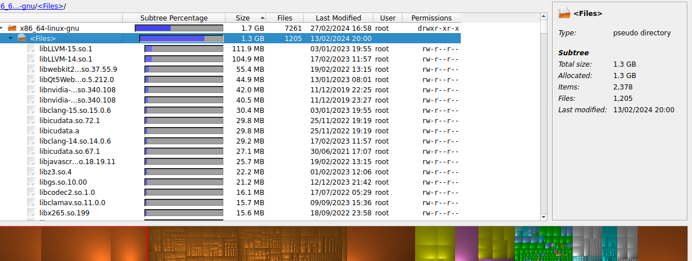

"Files" pseudo directory selected

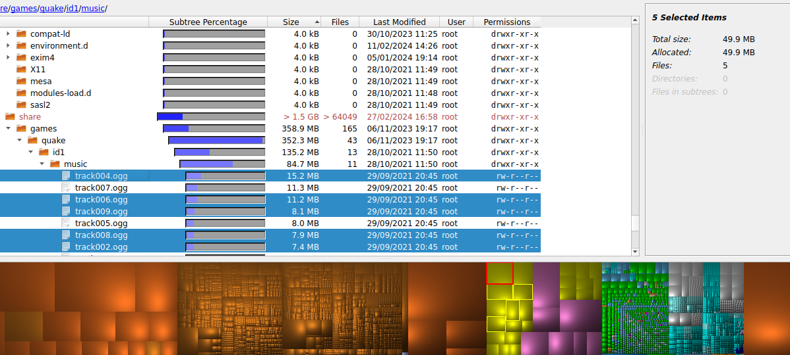

Multi-selection

## Open Directory Dialog

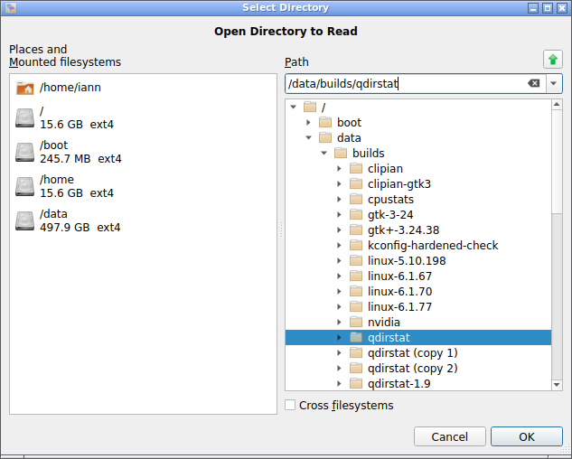

Custom "Open Directory" dialog with quick access to the home directory and to
mounted filesystems. The "Cross Filesystems" check box here is a temporary
override (just for this program run) of the configuration setting of the same
name.

## Output During Cleanup Actions

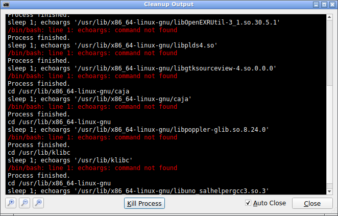

Screenshot of output during cleanup actions. Of course this window is purely optional.

## Error Reporting

Reporting errors during directory reading. Typically this is because of
missing permissions, so it may or may not be important to the user. Those
errors are reported in small panels at the bottom of the directory tree
widget. The user can leave them open or close them.

Clicking on the "Details..." link opens a separate window that lists all the
directories that could not be read. This window is non-modal, i.e. the user can
interact with the main window while it is open. A click on any directory in
that list locates that directory in the main window, i.e. opens all parent
branches and scrolls to ensure that directory is visible.

## Mounted Filesystems Window

This window (opened from the menu with View -> Show Mounted Filesystems) shows
the currently mounted filesystems. It does not show system mounts like /dev,
/proc, /sys, and also no bind mounts, no Btrfs subvolumes and no multiple
mounts of the same filesystem.

The "Reserved" column shows the amount of disk space that is reserved for the
root user; "Free" is what is available for non-privileged users.

## File Type Statistics

Menu View -> File Type Statistics...

## Locating Files by Type

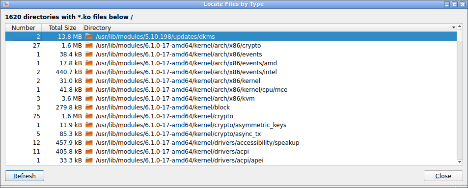

Results after clicking on the "Locate" button in the "File Type Statistics" window.

Locating files with a specific extension. That branch is automatically opened
in the tree view in the main window, and all matching files in that directory are selected.

## File Age Statistics

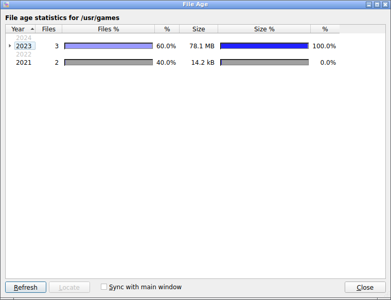

This window (opened fom the menu with View -> Show File Age Statistics) shows
the modification time (mtime) of files (not directories) in the selected
subtree broken down by years; i.e., it shows in what year the files were last
modified.

For each year, it shows the number of files that were last modified in that
year, the percent of that number relative to all files in that subtree both as
a percentage bar and as a number, the total size of those files and the percent
of that total size relative to the total size of that subtree, again as a
percentage bar and as a number.

File age statistics with the months of the current year expanded. It goes into
finer detail for the months of the current year and the year before, i.e. the
most recent 13-24 months. The percentages in the months are relative to that
year, not to the complete subtree.

Notice that the months breakdown is always only displayed for the current year
and the year before, no matter in what year any activity in that subtree
starts.

File age statistics for a subtree where there was no activity at all for the
last couple of years. Notice how the years up to that first active year are
also displayed, but greyed out: You can instantly see that the last activity
was some years ago, even without looking at the year numbers.

## Discovering Files

Discovering files of certain categories. Similar to "locating by type" above,
clicking a file in the list selects it in the tree view in the main window.

## Packages View

Packages view: All packages of a Xubuntu 18.04 LTS installation. Notice that
each directory contains only the files that belong to that package: /usr/bin
only contains the chromium-browser binary in this view.

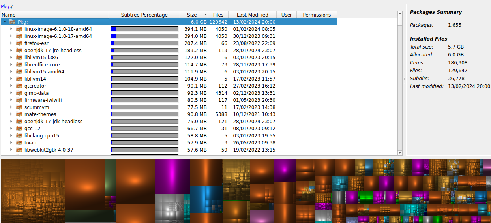

Packages Summary

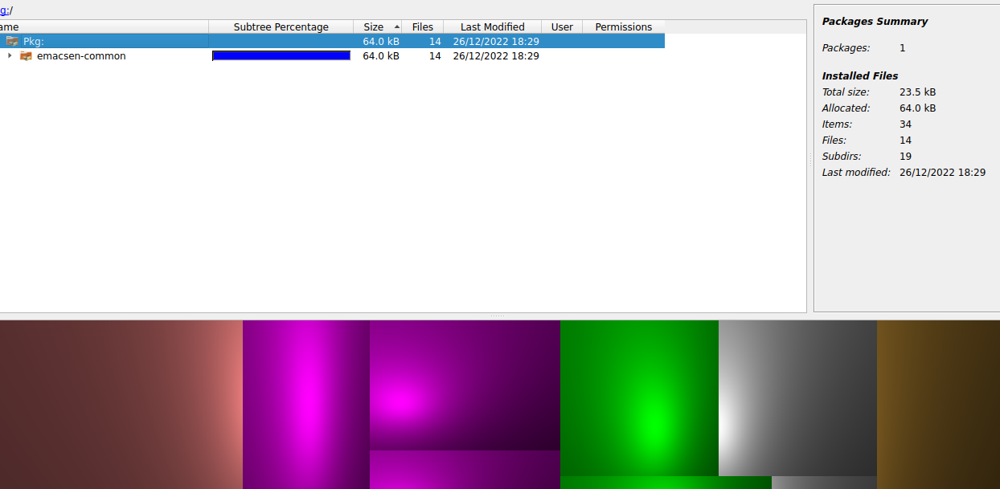

Packages view limited to package names starting with "emacs".

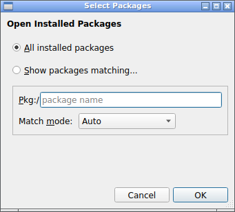

Dialog for selecting which packages to display. Use menu "File" -> "Show
Installed Packages".

To avoid the initial "Choose Directory" dialog, start QDirStat with the "-d"
or "--dont-ask" command line parameter (or simply click "Cancel" in the "Choose
Directory" dialog).

## Unpackaged Files View

Unpackaged files view: files in selected directories that are not part of
any package.  Directories that are not expected to contain packaged files
can be excluded from the tree, as well as specific types of files that are
commonly not in a package but are generated when a package is installed
(eg. \*.pyc Python files).

Notice the greyed-out ignored directories which contain the files that are
properly packaged.

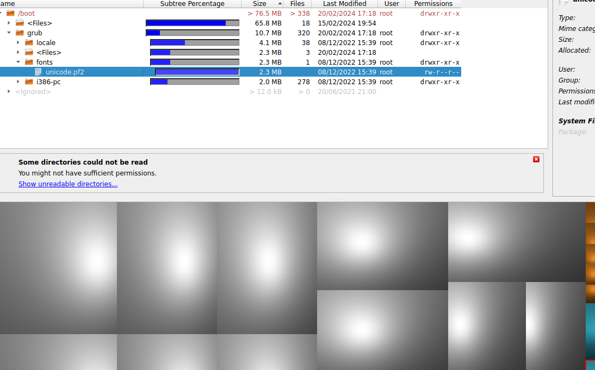

Unpackaged files view: I created my own font for Grub2 which clearly stands out as an unpackaged file.

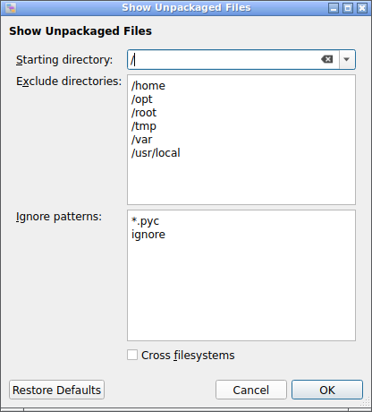

Dialog to start the "unpackaged files" view (Menu "File" -> "Show Unpackaged
Files"). Some directories are excluded by default because they are expected to
contain a lot of unpackaged files. You can add more directories or remove
predefined ones.

Since Python tends to leave behind so many unpackaged files, all `*.pyc` files
are ignored by default. You can add more wildcard patterns to ignore or remove
the predefined one.

## Configuration

Screenshot of cleanup actions configuration.

Screenshot of MIME category configuration where you can set the treemap colors
for different file types (MIME types), complete with a real treemap widget as preview.

Screenshot of the exclude rules configuration where you can define rules which
directories to exclude when reading directory trees.

Screenshot of the general (miscellaneous) configuration options.

------------------

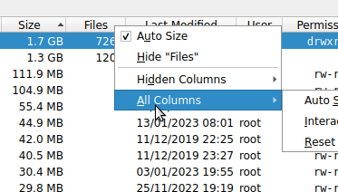

Context menu of the tree header where you can configure the columns.

-----------------

## File Size Statistics

File size histogram for a directory

File size histogram for all files of type .jpg (start from the File Type Statistics window)

Histogram settings can be tweaked

Logarithmic scale for the vertical axis if needed

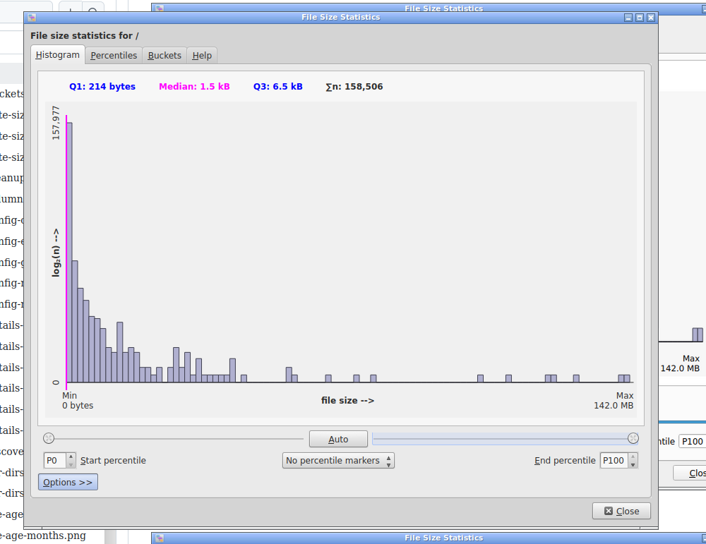

Degenerated histogram if the last percentiles are too far spread out

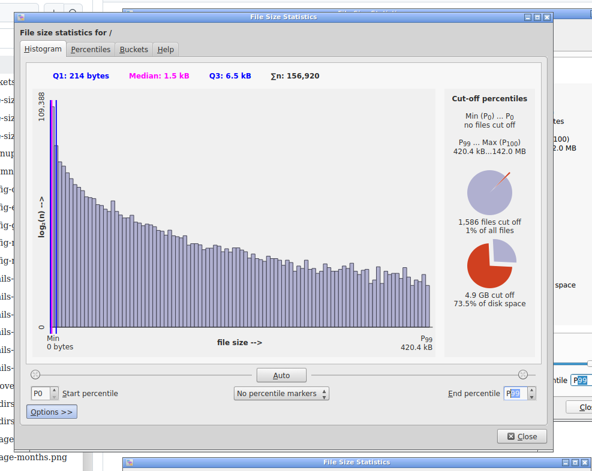

Just one percentile less makes all the difference: Scaled down from P100 to P99

Numeric percentiles table

Full percentiles table

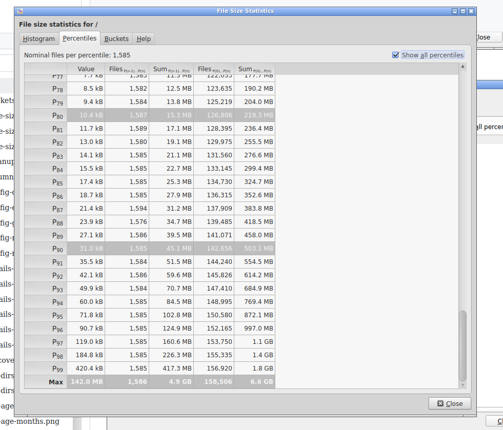

Notice the leap from P99 to P100

Buckets table (information also available by tooltips in the histogram)

Dedicated help start page for file size statistics

--------------------

## Navigation

[Top: QDirStat home page](https://github.com/shundhammer/qdirstat)

[Statistics help page](https://github.com/Lithopsian/qdirstat/tree/Qt6threaded/doc/stats/Statistics.md)
